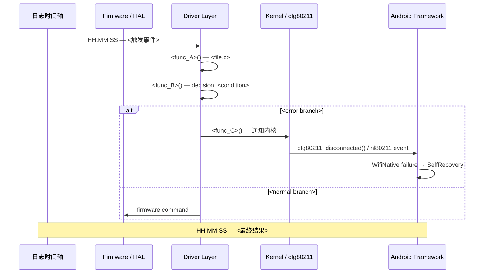

# Android WiFi Code Analyzer

This skill picks up where **android-wifi-log-analyzer** ends. It reads the two report files produced by that skill, locates the relevant driver source code, builds a complete function call chain, and — when a fix is warranted — generates a patch with user confirmation.

## Workflow Overview

```
wifi_analysis_notes.md  ──┐
                           ├──► Step 1: Parse reports
wifi_analysis_report.md  ──┘
        │
        ▼
Step 2: Confirm source path from user
        │
        ▼
Step 3: Locate driver source & trace call chain
        │
        ▼
Step 4: Output function chain report (with Mermaid diagram)
        │
        ▼
Step 5: Evaluate fix necessity → confirm with user → code patch
        │
        ▼
Step 6: Final deliverables
   ├── wifi_code_analysis_report.md  (function chain + Mermaid)
   └── wifi_code_fix_report.md       (patch / "no fix needed" note)
```

---

## Step 1 — Parse Analysis Reports

Locate `wifi_analysis_notes.md` and `wifi_analysis_report.md`. These files are written to **the same directory as the input log files**. If the user hasn't specified the directory, ask:

> "请提供日志文件所在目录，我会在该目录下查找 `wifi_analysis_notes.md` 和 `wifi_analysis_report.md`。"

Read both files and extract:

| Field | Source file | Purpose |
|---|---|---|
| Platform (Qualcomm / SPRD / Realtek) | notes or report header | Determine driver tree |
| Root cause layer (Layer N) | report `🔴 结论` section | Focus of code search |
| Root cause description | report `根因描述` | Key functions / subsystems to look up |
| Key log signatures (function names, event strings) | notes `过程三` / report `分层分析详情` | Grep anchors for source search |
| Fix suggestions | report `🔧 建议与后续步骤` → 中期 | Potential modification points |

If either file is missing or unreadable, stop and tell the user:
> "未找到 `wifi_analysis_notes.md` / `wifi_analysis_report.md`，请先运行 android-wifi-log-analyzer 生成分析报告，或手动指定报告路径。"

---

## Step 2 — Confirm Source Code Path

Before any file search, ask the user for the source root if not already provided in the conversation:

> "请提供 WLAN 驱动源码路径（例如 `/home/user/android/target/vendor/qcom/opensource/wlan`）。"

**Default search roots by platform:**

| Platform | Default driver path |
|---|---|
| Qualcomm | `<source_root>/target/vendor/qcom/opensource/wlan` |
| SPRD/UNISOC | `<source_root>/vendor/sprd/modules/wcn/wifi` or `<source_root>/kernel/drivers/net/wireless/sprd_wlan` |
| Realtek | `<source_root>/kernel/drivers/net/wireless/rtl8852bs` (or rtl8852be / rtw88 / rtw89) |

If the user provides a root but no driver subdirectory, apply the appropriate default above and confirm:
> "将在 `<resolved_path>` 下搜索源码，确认无误？"

Do **not** proceed to Step 3 until the path is confirmed.

---

## Step 3 — Locate Driver Source & Trace Call Chain

### 3.1 Identify entry-point symbols

From the root-cause analysis extract concrete identifiers to search for:

- **Event/function names** visible in logs (e.g., `cnss_pci_fw_boot_timeout`, `wcn_wifi_subsys_reset`, `sprdwl_rx_skb`)
- **Error strings** printed by the driver (grep for the literal string in `.c` / `.h` files)
- **Kernel call sites** from dmesg (`cfg80211_disconnected`, `ieee80211_connection_loss`)

Search strategy (use ripgrep / grep recursively):
```bash
# Find the function definition
grep -rn "function_name" <driver_path> --include="*.c" --include="*.h"

# Find callers
grep -rn "function_name(" <driver_path> --include="*.c"

# Find the error string
grep -rn '"<error string>"' <driver_path> --include="*.c"
```

### 3.2 Walk the call chain

Starting from the entry-point(s), trace upward (callers) **and** downward (callees) to build the full dispatch path. Typically 3–7 levels deep is sufficient. Focus on:

1. **Trigger path** — what event / IRQ / timer fires first?
2. **Decision points** — where does the driver branch on error conditions?
3. **Side-effects** — recovery actions, firmware reset, subsystem restart, netlink notifications

For each function in the chain record:
- File path + line number
- One-line description of what it does
- Key parameters / return values that influence flow

### 3.3 Cross-reference with log timeline

Map each function to the timestamps in `wifi_analysis_notes.md`. This confirms the code path actually executed and reveals any timing anomalies.

---

## Step 4 — Output Function Chain Report

Save to: **`<log_dir>/wifi_code_analysis_report.md`**

Use this exact template:

````markdown
# WiFi 驱动函数链路分析报告

> 📋 **基本信息**
> 平台：<Platform>　　驱动路径：`<driver_path>`
> 依据报告：wifi_analysis_report.md（根因：<root_cause_layer>）
> 分析日期：YYYY-MM-DD

---

## 🔍 分析依据摘要

| 项目 | 内容 |
|------|------|
| 根因层级 | <Layer N — name> |
| 根因描述 | <从 wifi_analysis_report.md 提取> |
| 关键日志锚点 | <用于源码定位的函数名 / 字符串> |
| 驱动源码路径 | `<driver_path>` |

---

## 📂 关键源文件索引

| 文件路径 | 作用 |
|----------|------|
| `<path/to/file.c>` | <一句话描述> |
| ... | ... |

---

## 🔗 函数调用链路（文字描述）

### 触发入口

**`<entry_function>()`** — `<file.c>:<line>`
> <描述该函数的职责及触发条件>

### 调用链

1. **`<func_A>()`** — `<file_A.c>:<line>`
   - 调用者：`<func_0>`
   - 职责：<描述>
   - 关键参数 / 返回值：<说明>

2. **`<func_B>()`** — `<file_B.c>:<line>`
   - 调用者：`<func_A>`
   - 职责：<描述>
   - 关键分支：`if (<condition>)` → <结果>

3. *(继续直至链路末端)*

### 终止节点

**`<terminal_function>()`** — `<file.c>:<line>`
> <该函数是链路终点，触发的最终行为（如：subsystem_restart、netlink通知上层、固件复位）>

---

## 📊 Mermaid 函数时序图



---

## 🗒️ 代码片段（关键路径）

### `<func_A>()` — `<file_A.c>:<line_start>-<line_end>`

```c
// <Brief comment explaining why this snippet matters>
<relevant code lines, trimmed to ≤30 lines>
```

### `<func_B>()` — `<file_B.c>:<line_start>-<line_end>`

```c
<relevant code lines>
```

---

## 📝 链路分析结论

<2–4 sentences summarising what the code trace confirms about the root cause, 
any discrepancies with the log analysis, and what the chain reveals about 
recovery / recurrence risk.>
````

---

## Step 5 — Evaluate Fix Necessity & Confirm with User

### 5.1 Determine whether a fix is needed

Read the `🔧 建议与后续步骤 → 中期（本版本修复）` section from `wifi_analysis_report.md`.

**Case A — No code modification warranted:**

If the root cause is a hardware fault, a configuration issue, a 3rd-party AP incompatibility, or the recommendation is "upgrade firmware" only, there is no source code change. Write to `wifi_code_fix_report.md`:

```markdown
# WiFi 代码修改报告

**结论：本次问题无需修改驱动/内核代码。**

| 原因 | 说明 |
|------|------|
| <reason> | <explanation> |

建议行动：<firmware upgrade / config change / AP-side workaround>
```

Stop here and notify the user.

**Case B — Code modification warranted:**

Identify the specific function(s) and line(s) to change from the call chain analysis.

Before making **any** changes, present a concise modification plan to the user:

```
📌 建议修改方案

修改点 1：
  文件：<path/to/file.c>
  函数：<function_name>() 第 <N> 行
  问题：<一句话说明为什么这里有问题>
  修改意图：<一句话说明修改方向>

修改点 2：（如有）
  ...

是否确认进行上述修改？(yes / no / 仅查看，不修改)
```

Wait for explicit user confirmation before proceeding.

### 5.2 Apply modifications (after user confirms)

For each approved modification point:
1. Read the exact file content around the target lines
2. Produce a unified diff (git diff format) showing only the necessary change
3. Apply the change
4. Verify the file is syntactically correct (no obvious broken brackets/syntax)

---

## Step 6 — Output Code Fix Report

Save to: **`<log_dir>/wifi_code_fix_report.md`**

Template:

````markdown
# WiFi 代码修改报告

> 📋 **基本信息**
> 平台：<Platform>　　驱动路径：`<driver_path>`
> 依据：wifi_analysis_report.md（根因：<root_cause_layer>）
> 修改日期：YYYY-MM-DD
> 修改状态：✅ 已应用 / ⏸️ 待确认 / ❌ 无需修改

---

## 🔴 问题回顾

<2 sentences: what went wrong and what layer it's in>

---

## 🛠️ 修改清单

### 修改点 1：`<function_name>()` — `<file.c>`

**问题描述：**
<Why this code is wrong / incomplete / missing a guard>

**修改前：**
```c
// <file.c>:<line_start>-<line_end>
<original code>
```

**修改后：**
```c
// <file.c>:<line_start>-<line_end>
<modified code>
```

**修改说明：**
<Explain what the change does and why it fixes the issue>

**影响范围：**
<Other callers / modules that may be affected; regression risk>

---

### 修改点 2：（如有）

*(same structure)*

---

## 📋 Unified Diff（可直接用于 patch）

```diff
diff --git a/<relative/path/to/file.c> b/<relative/path/to/file.c>
--- a/<relative/path/to/file.c>
+++ b/<relative/path/to/file.c>
@@ -<line>,<count> +<line>,<count> @@
 <context line>
-<removed line>
+<added line>
 <context line>
```

---

## ✅ 验证建议

- [ ] <编译验证命令，如 `make modules KDIR=...`>
- [ ] <复现场景步骤>
- [ ] <期望结果>
- [ ] <回归检查项>

---

## 📎 关联报告

- 日志分析报告：`wifi_analysis_report.md`
- 函数链路报告：`wifi_code_analysis_report.md`
````

---

## Step 7 — Final Summary

After both reports are written, output a brief summary in the conversation:

```
✅ 代码分析完成

📄 函数链路报告：<log_dir>/wifi_code_analysis_report.md
   └─ 函数链路：<entry> → ... → <terminal>（共 N 层）
   └─ 时序图：Mermaid sequenceDiagram（已嵌入报告）

📄 代码修改报告：<log_dir>/wifi_code_fix_report.md
   └─ 修改状态：✅ 已应用 N 处修改 / ❌ 无需修改

相关报告：wifi_analysis_report.md · wifi_analysis_notes.md
```

---

## Reference: Common Qualcomm Driver Entry Points

Useful starting symbols when root cause involves Qualcomm firmware/driver:

| Symptom | Entry function | File |
|---------|---------------|------|
| FW assert / fw_down | `cnss_pci_fw_boot_timeout` | `cnss2/pci.c` |
| Subsystem restart | `cnss_do_recovery` | `cnss2/qmi.c` or `bus.c` |
| PCIe link down | `cnss_pci_link_down` | `cnss2/pci.c` |
| QMI error | `cnss_qmi_ind_cb` | `cnss2/qmi.c` |
| wlan assert | `wlan_cfg80211_vendor_event` | `core/src/wlan_cfg80211.c` |
| Disconnect (cfg80211) | `wlan_hdd_cfg80211_disconnect` | `core/hdd/src/wlan_hdd_cfg80211.c` |
| Roam failure | `csr_roam_complete` | `core/sme/src/csr_api_roam.c` |
| TX stuck / watchdog | `wma_tx_failure_cb` | `core/wma/src/wma_data.c` |

## Reference: Common SPRD Driver Entry Points

| Symptom | Entry function | File |
|---------|---------------|------|
| CP2 assert / WCN reset | `wcn_subsys_reset` | `wcn/bus/wcn_bus.c` |
| SPRD WiFi down | `sprdwl_reset_wifi` | `wifi/cfg80211.c` or `main.c` |
| RX error | `sprdwl_rx_skb` | `wifi/rx.c` |
| TX stuck | `sprdwl_tx_timeout` | `wifi/tx.c` |
| Connection failure | `sprdwl_cfg80211_connect` | `wifi/cfg80211.c` |

---

## Notes on Code Search Depth

- Aim for **3–7 function levels** in the call chain; deeper is rarely necessary and harder to read.
- If a function is in a header-only inline or macro, note it inline rather than as a separate chain level.
- When multiple code paths exist (e.g., STA vs SAP, or recovery vs no-recovery), show the path that matches the log evidence and briefly note the other branch.
- Prefer showing **the actual executed path** (confirmed by log timestamps) over speculative paths.
