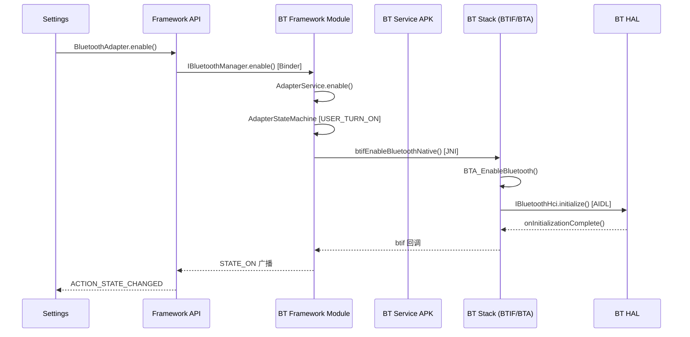
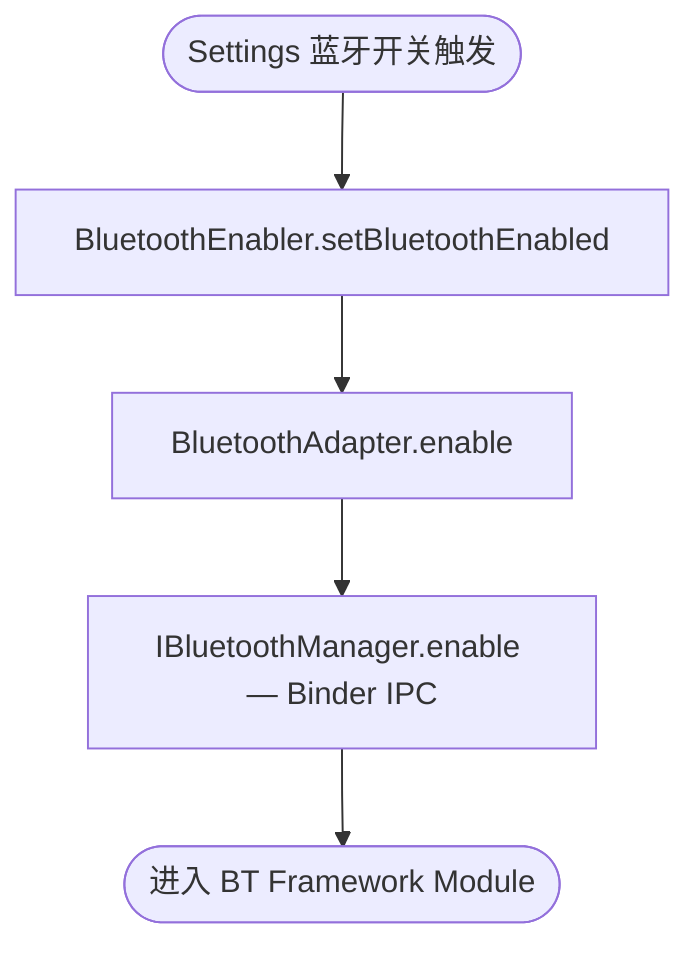
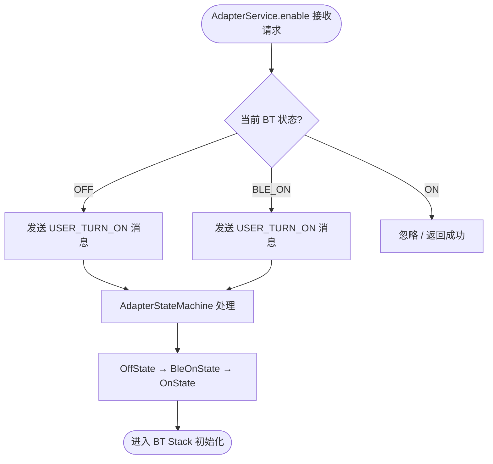
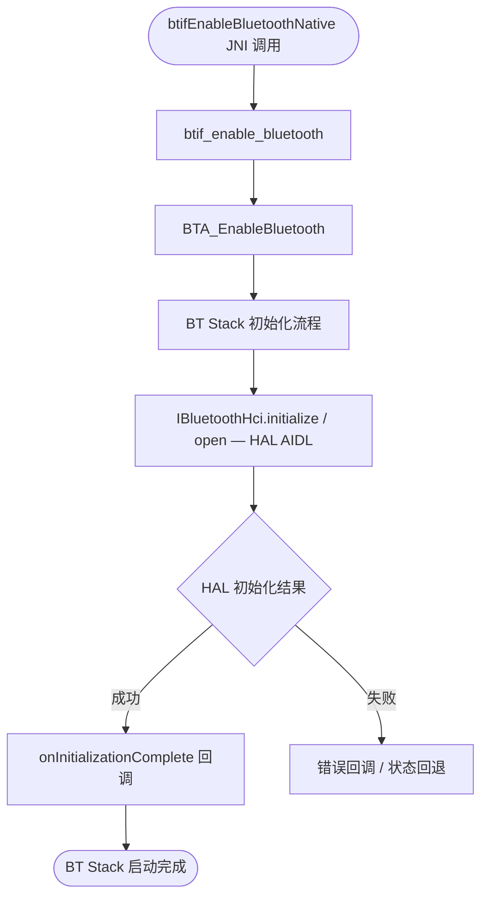
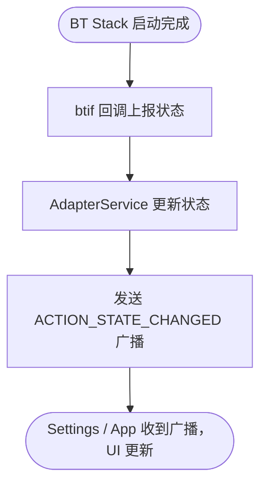
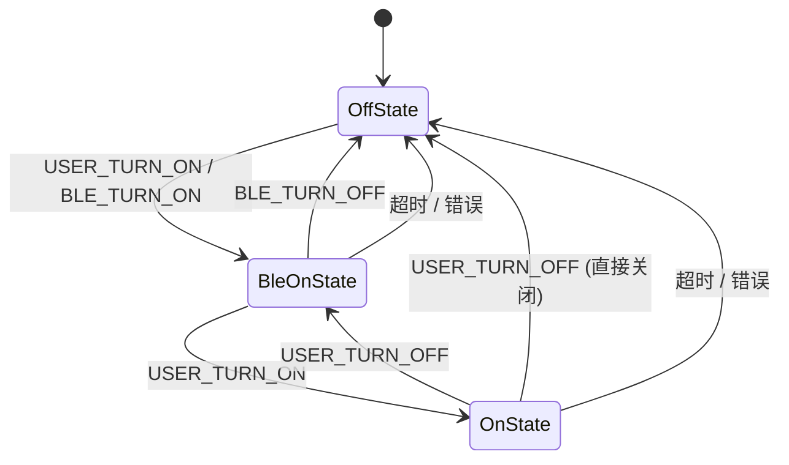

# bt_code_link 重型中文报告模板

以下模板不是"建议"，而是默认输出协议。

最终文档必须尽量遵循这个结构；允许按目标链路替换子内容，但不要退化成简版报告。

````md
# 概览

> 分析基于：`<repo_root>`
>
> 目标链路：`<target_flow>`

- **分析入口**：`<entry symbol>`
- **最深已证实边界**：`<deepest confirmed boundary>`
- **结论先行**：<用中文总结本次链路的关键结论>

---

## 一、层级路径说明

### 1.1 本次分析采用的层级划分

| 层级 | 路径 | 说明 |
|------|------|------|
| Settings | `<path>` | `<说明>` |
| Framework API | `<path>` | `<说明>` |
| BT Framework Module | `<path>` | `<说明>` |
| BT Service APK | `<path>` | `<说明>` |
| BT Stack | `<path>` | `<说明>` |
| BT HAL | `<path>` | `<说明>` |

### 1.2 层级职责说明

- `<中文说明各层的职责边界，重点区分 BT Stack / HAL / Service APK / Framework Module>`

---

## 二、层级错误订正

> 仅当发现用户给的层级、路径或职责归属有问题时输出。

### 用户提供的层级 / 路径

| 层级 | 用户输入 | 问题 | 正确归属 |
|------|----------|------|----------|
| `<层级>` | `<原始输入>` | `<问题>` | `<正确归属>` |

### 修正后的层级结构

```text
<修正后的文字层级树>
```

---

## 三、完整调用链

```text
<从入口到最深边界的完整主链>

例如（bt_enable）：
BluetoothEnabler.setBluetoothEnabled()
  → BluetoothAdapter.enable()
    → IBluetoothManager.enable() [Binder IPC]
      → BluetoothManagerService.enable()
        → AdapterService.enable()
          → AdapterStateMachine [USER_TURN_ON]
            → AdapterState: OffState → BleOnState → OnState
              → btifEnableBluetoothNative() [JNI]
                → btif_enable_bluetooth()
                  → BTA_EnableBluetooth()
                    → IBluetoothHci.initialize() [HAL AIDL]
                      → [Vendor HAL / Controller HCI]
```

如果链路很长，可按阶段拆分：

- 请求进入阶段
- Framework 服务仲裁阶段
- BT Stack 初始化阶段
- HAL / Controller 启动阶段

---

## 四、关键函数分层解析

### 4.1 Settings / 上层入口

| 函数 | 文件 | 意义 | 下一跳 | 证据强度 |
|------|------|------|--------|----------|
| `<symbol>` | `<path>` | `<中文说明>` | `<next hop>` | 已证实 / 间接推断 / 未解析 |

### 4.2 Framework API 层

| 函数 | 文件 | 意义 | 下一跳 | 证据强度 |
|------|------|------|--------|----------|
| `<symbol>` | `<path>` | `<中文说明>` | `<next hop>` | 已证实 / 间接推断 / 未解析 |

### 4.3 BT Framework Module 服务层

| 函数 | 文件 | 意义 | 下一跳 | 证据强度 |
|------|------|------|--------|----------|
| `<symbol>` | `<path>` | `<中文说明>` | `<next hop>` | 已证实 / 间接推断 / 未解析 |

### 4.4 BT Service APK 层（按需）

| 函数 | 文件 | 意义 | 下一跳 | 证据强度 |
|------|------|------|--------|----------|
| `<symbol>` | `<path>` | `<中文说明>` | `<next hop>` | 已证实 / 间接推断 / 未解析 |

### 4.5 BT Stack BTIF / BTA 层

| 函数 | 文件 | 意义 | 下一跳 | 证据强度 |
|------|------|------|--------|----------|
| `<symbol>` | `<path>` | `<中文说明>` | `<next hop>` | 已证实 / 间接推断 / 未解析 |

### 4.6 BT HAL / Controller 层

| 函数 / 接口 | 文件 | 意义 | 下一跳 | 证据强度 |
|------|------|------|--------|----------|
| `<symbol>` | `<path>` | `<中文说明>` | `<next hop>` | 已证实 / 间接推断 / 未解析 |

---

## 五、Mermaid 时序图

### 5.1 跨层主时序图



---

## 六、Mermaid 分阶段流程图

### 6.1 阶段一：Settings / Framework 请求阶段



### 6.2 阶段二：BT Framework Module / StateMachine 仲裁阶段



### 6.3 阶段三：BT Stack / HAL 执行阶段



必要时可以额外加：

### 6.4 阶段四：状态回调返回阶段



---

## 七、代码状态机图

> 仅当本次链路实际命中真实代码状态机时输出。

### 7.1 `AdapterStateMachine`（蓝牙适配器主状态机）



状态机图必须体现：

1. 真实状态机类名
2. 状态触发事件
3. 状态推进路径
4. 成功 / 失败 / 回退分支

如果当前链路没有命中真实代码状态机，则在正文说明：

- 当前链路未命中真实代码状态机，因此本节不输出状态机图。

---

## 八、架构说明

### 8.1 分层职责

- **Settings / App 触发层**：负责用户界面交互，蓝牙开关触发来自此层
- **Framework API 层**：`BluetoothAdapter` / `BluetoothManager` 提供公开 API，通过 Binder 与 BT 系统服务通信
- **BT Framework Module 服务层**：`AdapterService` 是蓝牙核心系统服务，管理蓝牙生命周期与 Profile 服务
- **BT Service APK 层**：实现各蓝牙 Profile（A2DP、HFP、HID 等），通过 BTIF JNI 与 native 栈交互
- **BT Stack BTIF / BTA / Stack 层**：`btif` 是 Java/JNI 桥接层；`bta` 是 BT Application 层；`stack` 是协议栈实现
- **BT HAL 接口层**：通过 AIDL/HIDL 接口与蓝牙控制器通信，屏蔽 vendor 差异
- **BT Controller / Firmware 层**：蓝牙芯片固件，通过 HCI 协议与 HAL 通信

### 8.2 关键通信边界

- `Framework API → BT Framework Module`：Binder IPC（`IBluetoothManager`）
- `BT Framework Module → BT Stack`：JNI（`btifEnableBluetoothNative` 等 native 方法）
- `BT Stack → BT HAL`：AIDL（Android 12+）或 HIDL（旧版本）
- `BT HAL → BT Controller`：HCI 通信（UART / USB / SDIO）

### 8.3 本次链路的关键架构结论

- `<中文总结>`

---

## 九、关键源码索引

| 层级 | 关键文件 | 说明 |
|------|---------|------|
| Settings | `BluetoothEnabler.java` | 蓝牙开关 UI 控制器 |
| Framework API | `BluetoothAdapter.java` | 公开 BT 适配器 API |
| Framework API | `BluetoothManager.java` | 蓝牙管理器入口 |
| BT Framework Module | `AdapterService.java` | BT 核心系统服务 |
| BT Framework Module | `AdapterStateMachine.java` | BT 适配器状态机 |
| BT Service APK | `A2dpService.java` | A2DP Profile 服务 |
| BT Service APK | `HeadsetService.java` | HFP Profile 服务 |
| BT Stack BTIF | `btif_core.cc` | BTIF 核心初始化 |
| BT Stack BTA | `bta_dm_act.cc` | BTA 设备管理动作 |
| BT HAL | `IBluetoothHci.aidl` | BT HAL AIDL 接口 |

---

## 十、变体、风险点与未解析边界

### 10.1 变体

- `<vendor 差异、实现变体>`

### 10.2 风险点

- `<链路中容易误判的点>`

### 10.3 未解析边界

- `<到哪一层后没有直接源码证据>`

### 10.4 证据强度总结

- **已证实**：`<内容>`
- **间接推断**：`<内容>`
- **未解析**：`<内容>`
````

---

## 模板约束

1. 章节名默认使用中文。
2. 不要省略"关键源码索引"。
3. 不要把"完整调用链"替换成简单函数列表。
4. 如果没有错误，就不要硬输出"层级错误订正"。
5. 必须有至少一张时序图。
6. 必须有至少两张分阶段流程图。
7. 状态机图只允许来源于真实代码 StateMachine。
