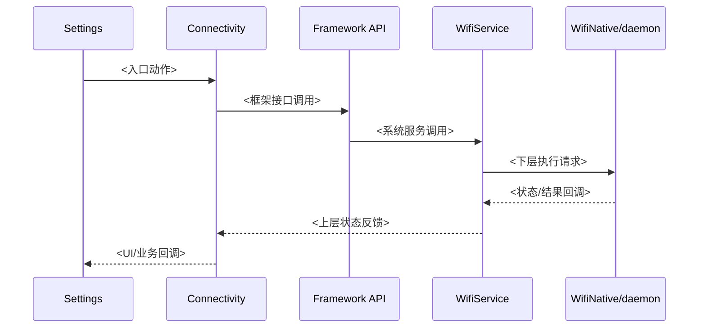
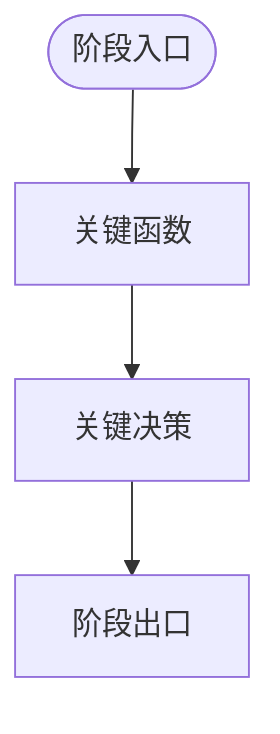
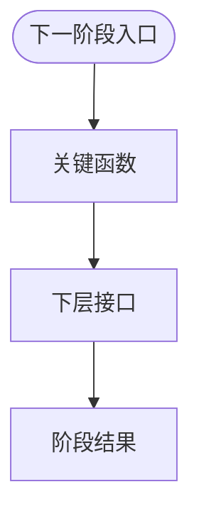
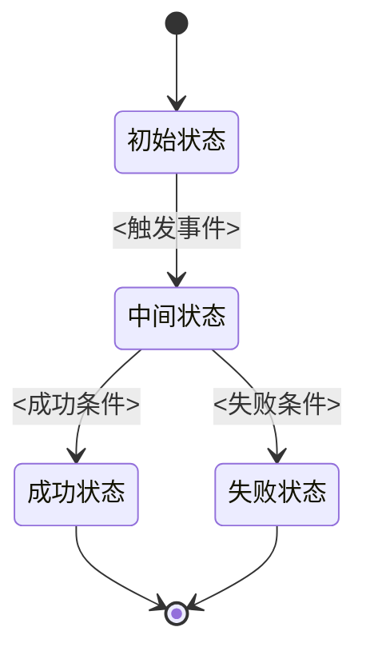

# wifi_code_link 重型中文报告模板

以下模板不是“建议”，而是默认输出协议。

最终文档必须尽量遵循这个结构；允许按目标链路替换子内容，但不要退化成简版报告。

````md
# 概览

> 分析基于：`<repo_root>`
>  
> 目标链路：`<target_flow>`

- **分析入口**：`<entry symbol>`
- **最深已证实边界**：`<deepest confirmed boundary>`
- **结论先行**：<用中文总结本次链路的关键结论>

---

## 一、层级路径说明

### 1.1 本次分析采用的层级划分

| 层级 | 路径 | 说明 |
|------|------|------|
| Settings | `<path>` | `<说明>` |
| Framework | `<path>` | `<说明>` |

### 1.2 层级职责说明

- `<中文说明 framework / daemon / HAL / kernel / driver 的职责边界>`

---

## 二、层级错误订正

> 仅当发现用户给的层级、路径或职责归属有问题时输出。

### 用户提供的层级 / 路径

| 层级 | 用户输入 | 问题 | 正确归属 |
|------|----------|------|----------|
| `<层级>` | `<原始输入>` | `<问题>` | `<正确归属>` |

### 修正后的层级结构

```text
<修正后的文字层级树>
```

---

## 三、完整调用链

```text
<从入口到最深边界的完整主链>
```

如果链路很长，可按阶段拆分：

- 初始化阶段
- 启动阶段
- 连接阶段
- 状态回调阶段

---

## 四、关键函数分层解析

### 4.1 Settings / 上层入口

| 函数 | 文件 | 意义 | 下一跳 | 证据强度 |
|------|------|------|--------|----------|
| `<symbol>` | `<path>` | `<中文说明>` | `<next hop>` | 已证实 / 间接推断 / 未解析 |

### 4.2 Connectivity / Framework / Service / HAL / daemon / Kernel / Driver

按层重复展开，不要省略关键中间层。

---

## 五、Mermaid 时序图

### 5.1 跨层主时序图



---

## 六、Mermaid 分阶段流程图

### 6.1 阶段一流程图



### 6.2 阶段二流程图



必要时继续增加：

- 阶段三流程图
- 状态回调返回阶段图

要求：

1. 不要只放一张线性总流程图
2. 必须按阶段拆图
3. `sap_open` 默认至少拆出：
   - Settings / Tethering 请求阶段
   - WifiService / StateMachine 仲裁阶段
   - WifiNative / Hostapd AP 启动阶段

---

## 七、代码状态机图

> 仅当本次链路实际命中真实代码状态机时输出。

### 7.1 `<StateMachine 类名>`



状态机图必须体现：

1. 真实状态机类名
2. 状态触发事件
3. 状态推进路径
4. 成功 / 失败 / 回退分支

如果当前链路没有命中真实代码状态机，则在正文说明：

- 当前链路未命中真实代码状态机，因此本节不输出状态机图。

---

## 八、架构说明

### 8.1 分层职责

- `<中文解释 Settings / Framework / HAL / daemon / kernel / driver 各自负责什么>`

### 8.2 关键通信边界

- `<例如 Binder / AIDL / HIDL / Netlink / cfg80211>`

### 8.3 本次链路的关键架构结论

- `<中文总结>`

---

## 九、关键源码索引

| 层级 | 关键文件 | 说明 |
|------|---------|------|
| Framework Service | `<path>` | `<中文说明>` |
| Hostapd | `<path>` | `<中文说明>` |

---

## 十、变体、风险点与未解析边界

### 10.1 变体

- `<vendor 差异、实现变体>`

### 10.2 风险点

- `<链路中容易误判的点>`

### 10.3 未解析边界

- `<到哪一层后没有直接源码证据>`

### 10.4 证据强度总结

- **已证实**：`<内容>`
- **间接推断**：`<内容>`
- **未解析**：`<内容>`
````

---

## 模板约束

1. 章节名默认使用中文。
2. 不要省略“关键源码索引”。
3. 不要把“完整调用链”替换成简单函数列表。
4. 如果没有错误，就不要硬输出“层级错误订正”。
5. 必须有至少一张时序图。
6. 必须有至少两张分阶段流程图。
7. 状态机图只允许来源于真实代码 StateMachine。
